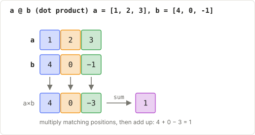
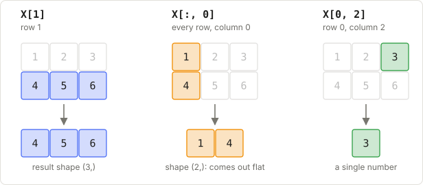
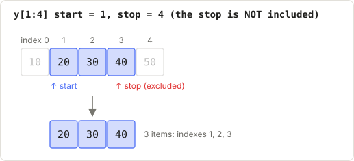
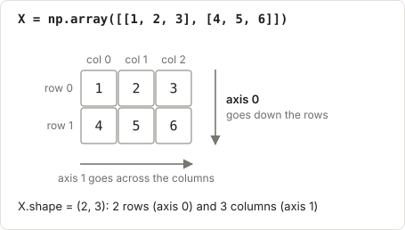
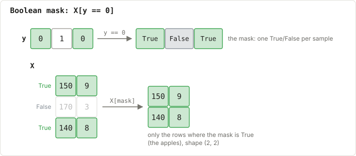
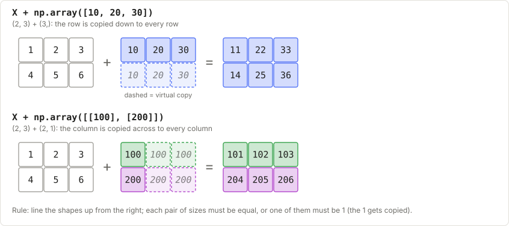
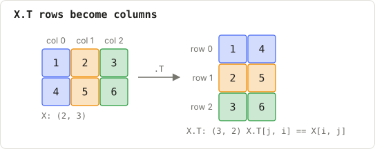

# B1: Glossary

Every term used in this course, in plain English. Lectures link here, so you can jump to a word, read it, and go back.

## The running example

You measured some fruit and wrote down what each one is:

| | weight (g) | smoothness (0–10) | fruit |
|---|---|---|---|
| fruit #0 | 150 | 9 | apple |
| fruit #1 | 170 | 3 | orange |
| fruit #2 | 140 | 8 | apple |

In code:

```python
import numpy as np

X = np.array([[150, 9],
              [170, 3],
              [140, 8]])
y = np.array([0, 1, 0])     # 0 = apple, 1 = orange
```

Every definition below refers back to this table.

---

## Words about data

### Dataset

The whole table of examples you learn from. Here, all 3 fruit.

### Sample

One row of the dataset: one fruit. Also called an **example**, a **data point**, an **observation** or a **row**.
The letter **n** usually means "the number of samples" (here n = 3).

### Feature

One measured property of each sample: here *weight* and *smoothness*. Features are what the model **looks at**.
Each feature is one **column**. The letter **f** (or **d**) usually means "the number of features" (here f = 2).

### Label

The answer for a sample: what we want the model to predict. Here, *apple* or *orange*. Also called the **target**.

### Class

One possible label value, in a problem where the answer is a category. Here there are 2 classes: apple and orange.

### Class 0 and class 1

Computers work with numbers, so each class gets a number, counting from 0: apple → **class 0**, orange → **class 1**.
The number is just a **name tag**. It doesn't mean "smaller" or "worse". In a spam filter, class 0 might mean
"not spam" and class 1 "spam". With 3 classes you'd have 0, 1 and 2.

### X and y

The standard variable names in ML code:

- **`X`** (capital) is the feature table: one row per sample, one column per feature. Shape `(n, f)`.
- **`y`** (lower case) holds the labels: one per sample. Shape `(n,)`.

They line up row by row: `y[0]` is the label of the sample `X[0]`.

### Training data and test data

You split the dataset in two:

- the **training data** is used to teach the model
- the **test data** is hidden from the model during training and used afterwards to check how well it works on fruit it has never seen

It's like studying from past papers (training) and then sitting the real exam (test).

### Noise

Random mess in data: measurement errors, wrongly written labels. A good model learns the real pattern and ignores the noise.

---

## Words about models

### Model

A program that learns a pattern from examples and can then make guesses about new ones. For example: "fruit with
smoothness above 6 is an apple".

### Training

Showing the model the training data **with** the answers so it can learn the pattern. Also called **fitting**.
In code, it's the `fit` method: `model.fit(X, y)`.

### Prediction

The model's guess for a sample. You give it features **without** the answer and it returns a label:
`model.predict(X_new)`. Prediction variables are often named `y_pred` or `y_hat` (written $\hat y$ in maths).

### Parameter

A number **inside** the model that it **learns** during training. Examples: the weights in linear regression,
the centre points in K-Means, the questions in a decision tree.

(Careful: in Python, "parameter" also means a function input. See [Argument](#argument).)

### Weight

A parameter that says how much a feature matters. A big weight on smoothness means smoothness strongly affects the
prediction. Usually written $w$. Many weights together are written as a vector $w$ or a matrix $W$.

### Bias

An extra parameter that is added on at the end, a baseline value. Usually written $b$. (It has nothing to do with "unfair bias".)

### Hyperparameter

A setting **you** choose before training, which the model doesn't learn. Examples: k in KNN (how many neighbours vote),
the learning rate, the maximum tree depth.

### Classification

A problem where the answer is a **category** (apple or orange; spam or not spam).

### Regression

A problem where the answer is a **number** (a house price, tomorrow's temperature).

### Clustering

Finding groups in data **without** any labels. For example, sorting fruit into piles by similarity without knowing the fruit names.

### Supervised and unsupervised

- **Supervised** learning has labels (`X` and `y`). Classification and regression are supervised.
- **Unsupervised** learning has only `X`. Clustering and PCA are unsupervised.

### Loss

A single number measuring **how wrong** the model's predictions are. Training tries to make the loss as small as possible.
Also called the **cost** or **error**.

### Accuracy

The fraction of predictions that are correct. If the model gets 9 out of 10 right, the accuracy is 0.9 (90%).

### Overfitting

The model memorises the training data, noise included, so it scores brilliantly on training data but badly on new data.
It's like memorising past-paper answers without understanding them.

### Underfitting

The model is too simple to capture the pattern, so it does badly even on the training data.

### Threshold

A cut-off value for making a decision, e.g. "if the probability of spam is above 0.5, call it spam".

---

## Words about maths

### Vector

A list of numbers, e.g. one fruit's features `[150, 9]`. In NumPy it's a 1-D array.

### Matrix

A table (grid) of numbers with rows and columns, like `X`. In NumPy it's a 2-D array.

### Dot product

Multiply two equal-length lists item by item, then add up the results:
`[1, 2] · [3, 4] = 1×3 + 2×4 = 11`. Written `a @ b` in NumPy. It's how a model combines features with weights.



*Matching colours are multiplied, then added up.*

### Distance

How far apart two points are. The usual one (**Euclidean distance**) is the straight-line distance: for `[1, 1]` and `[4, 5]`
it is $\sqrt{3^2 + 4^2} = 5$.

### Mean

The average: add the values up and divide by how many there are. The mean of 2, 4 and 9 is 15 / 3 = 5.

### Variance

How spread out values are around their mean: the average squared distance from the mean. The **standard deviation** is its square root.

### Probability

A number from 0 to 1 saying how likely something is. 0 means impossible, 1 means certain, 0.5 means a coin flip.

### Gradient

The direction and steepness of "uphill" for the loss. Training moves the parameters **downhill**, against the gradient,
to reduce the loss. Explained properly in [F3](../00_foundations/F3_calculus_and_gradient_descent.md).

### Gradient descent

The training method of repeatedly taking small steps downhill on the loss.

### Learning rate

How big each gradient-descent step is. Too big and you overshoot; too small and it takes forever.

### Iteration

One repeat of a loop, e.g. one gradient-descent step. An **epoch** is one pass over the whole training data.

### Centroid

The centre point of a group: the mean of its points. K-Means uses centroids.

### One-hot

A way of writing a class number as a list with a single 1. With 3 classes: class 0 → `[1, 0, 0]`, class 2 → `[0, 0, 1]`.

---

## Words about arrays (NumPy)

### Array

NumPy's container for numbers: a list (1-D), a table (2-D), or a stack of tables (3-D and up). Created with `np.array(...)`.

### Element

One single number inside an array. In `X` above, `9` is one element.

### Index

The **position number** of an item, starting from **0**:

```
y = [ 0,  1,  0 ]
      ↑   ↑   ↑
index 0   1   2
```

`y[1]` means "the item at index 1", which is `1`. A negative index counts from the end: `y[-1]` is the last item.

**Don't mix up index and class.** "Index 0" means *the first position*; "class 0" means *the category named 0* (apple).
`y[1]` asks for the item at **index** 1, and the answer is **class** 1 (orange).

### Row and column

In a 2-D array, a **row** goes across (one sample) and a **column** goes down (one feature). You index them with `[row, column]`:

```python
X[0, 1]   # row 0, column 1 -> 9
X[1]      # all of row 1    -> [170, 3]
X[:, 0]   # all rows, column 0 -> [150, 170, 140]
```



*Coloured cells are selected; grey ones are left out.*

### Slice

A range of items, written `start:stop` (the stop position itself is **not** included):

- `y[0:2]` → the items at index 0 and 1
- `:` on its own means "everything"



*The stop index (4) is not included.*

### Shape

The size of an array, as a tuple of numbers. `X.shape` is `(3, 2)`: 3 rows, 2 columns. `y.shape` is `(3,)`: a list of 3.

### Dimension

How many numbers the shape has. A list is 1-D (`(3,)`), a table is 2-D (`(3, 2)`), a stack of tables is 3-D (`(4, 3, 2)`).
Each of these directions is called an **axis**.

### Axis

A direction in an array. In a table, **axis 0** goes down the rows and **axis 1** goes across the columns.
`X.mean(axis=0)` averages down each column (one mean per feature). `X.mean(axis=1)` averages across each row (one per sample).
A memory aid: the axis you name is the one that disappears from the shape.



*Axis 0 runs down the rows, axis 1 across the columns.*

### Mask

An array of True/False values used to pick items:

```python
y == 0        # [True, False, True]   "is this an apple?"
X[y == 0]     # only the apple rows -> [[150, 9], [140, 8]]
```

Also called **boolean indexing** ("boolean" means True/False).



*Green rows are kept; the faded row is dropped.*

### Broadcasting

NumPy automatically stretching (copying) a smaller array to match a bigger one, so you can do things like
`X - X.mean(axis=0)` (subtract each column's mean from every row) without a loop. See [F1](../00_foundations/F1_numpy.md).



*Dashed cells are virtual copies.*

### Vectorised

Code that works on whole arrays at once instead of looping over items one by one. It's shorter and much faster.

### Transpose

Flipping a table so that its rows become columns: `X.T`. A `(3, 2)` array becomes `(2, 3)`.



*Each coloured column becomes a row.*

---

## Words about Python

### Variable

A name that stores a value: `age = 30`. Explained in [B2](B2_python_basics.md).

### List

Python's built-in ordered collection: `[3, 1, 4]`. NumPy arrays are like lists, but built for maths.

### Function

A named, reusable piece of code that takes inputs and gives back an output:

```python
def double(x):
    return x * 2

double(5)   # 10
```

### Argument

A value you pass into a function. In `double(5)`, `5` is the argument. Inside the function's definition the input names
(`x` here) are called **parameters**. That is a different meaning from a model's learned [parameters](#parameter).

### Return value

What a function hands back, using `return`. A function without `return` gives back `None`.

### Loop

Code that repeats: `for item in items:` runs once for each item.

### Class

A blueprint for making objects that bundle data and functions together. Every model in this course is a class
(`class KNN:`). See [B2](B2_python_basics.md#7-classes-the-pattern-every-model-uses).

### Object

One thing made from a class: `model = KNN(k=3)` makes a KNN object. Also called an **instance**.

### Method

A function that belongs to a class, called with a dot: `model.fit(X, y)`.

### Attribute

A value stored on an object, accessed with a dot: `model.k`, `model.weights`.

### self

Inside a class, `self` means "this particular object". `self.k = k` stores `k` on the object so other methods can use it later.

### Module and import

A **module** is a file of Python code. `import numpy as np` loads the NumPy module and lets you call it `np`.

### None

Python's value for "nothing" or "not set".

### True and False

The two **boolean** values. Comparisons produce them: `3 > 2` is `True`.

### Error and traceback

When something goes wrong, Python stops and prints a **traceback**. **Read its last line first**: it names the error and the reason.
How to read the rest is covered in [B2](B2_python_basics.md#9-reading-error-messages).

### NotImplementedError

The error the practice files raise on purpose, meaning "this part hasn't been written yet". When you write the code,
delete the `raise NotImplementedError(...)` line.
