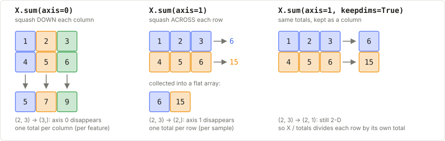
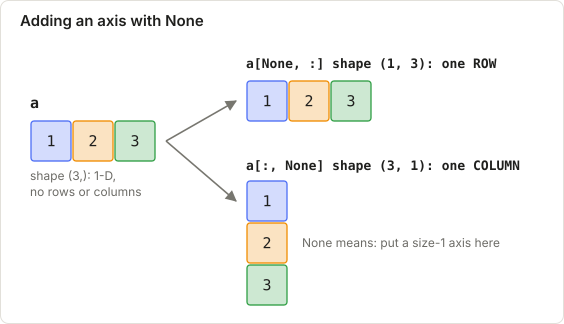
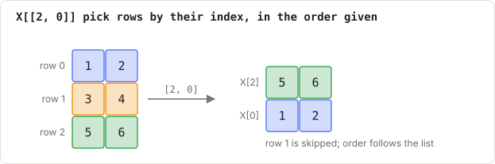
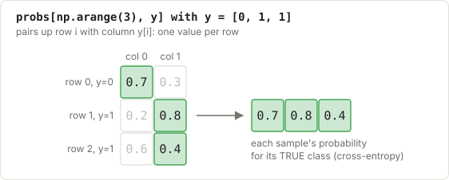

# F1: NumPy essentials

**New words?** [array](../00_basics/B1_glossary.md#array) · [shape](../00_basics/B1_glossary.md#shape) · [axis](../00_basics/B1_glossary.md#axis) · [index](../00_basics/B1_glossary.md#index) · [row and column](../00_basics/B1_glossary.md#row-and-column) · [slice](../00_basics/B1_glossary.md#slice) · [mask](../00_basics/B1_glossary.md#mask) · [broadcasting](../00_basics/B1_glossary.md#broadcasting) · [vectorised](../00_basics/B1_glossary.md#vectorised) · [transpose](../00_basics/B1_glossary.md#transpose) · [sample](../00_basics/B1_glossary.md#sample) · [feature](../00_basics/B1_glossary.md#feature) · or the full [glossary](../00_basics/B1_glossary.md).

**Learning objectives.** After this lecture you can:

- read and predict the **shape** of any array expression in this course
- use `axis=` correctly in `sum`, `mean`, `argmax`, …
- explain **broadcasting** and use `None` to add an axis
- use boolean masks and fancy indexing

---

## 1. Why NumPy?

ML data is a table of numbers. With *n* samples (rows) and *f* features (columns), the dataset is
an array `X` with shape `(n, f)`. NumPy lets you do maths on the whole table at once
("vectorised") instead of writing Python loops, which are often 100× slower.

```python
import numpy as np

X = np.array([[1.0, 2.0],
              [3.0, 4.0],
              [5.0, 6.0]])   # 3 samples, 2 features
X.shape   # (3, 2)
X[0]      # first sample  -> array([1., 2.])
X[:, 1]   # second feature for all samples -> array([2., 4., 6.])
```


*Coloured cells are the ones selected; grey ones are left out. Note that a column comes out as a flat 1-D array.*

> **Convention used in this whole course:** rows = samples, columns = features.
> `y` (the labels) is a 1-D array of shape `(n,)`.

## 2. Shapes are everything

Most bugs in ML code are shape bugs. Get into the habit of writing the shape next to every line:

```python
w = np.zeros(2)        # (2,)       one weight per feature
pred = X @ w           # (3,2) @ (2,) -> (3,)   one prediction per sample
```

Useful shape tools:

| Code | Effect |
|------|--------|
| `a.shape` | the shape tuple |
| `a.reshape(2, 3)` | same data, new shape (the sizes must multiply to the same total) |
| `a.T` | transpose (swap rows and columns) |
| `a[:, None]` or `a[:, np.newaxis]` | insert a new axis of size 1 |
| `a.transpose(0, 2, 1, 3)` | reorder axes (used in attention) |

## 3. Axes: which direction am I reducing?

`axis=k` means "collapse axis k". For a 2-D array:


*Axis 0 is the downward direction (rows), axis 1 is the across direction (columns).*


- `axis=0` collapses the **rows**, giving one value per column (per feature)
- `axis=1` collapses the **columns**, giving one value per row (per sample)

```python
X.mean(axis=0)   # mean of each feature  -> array([3., 4.])         shape (2,)
X.sum(axis=1)    # total of each sample  -> array([ 3.,  7., 11.])  shape (3,)
```

Memory aid: the axis you name is the one that **disappears** from the shape. `(3, 2)` with
`axis=0` gives `(2,)`.

`keepdims=True` keeps the collapsed axis with size 1. You need it when you divide back:

```python
row_sums = X.sum(axis=1, keepdims=True)   # (3, 1) instead of (3,)
X / row_sums                              # each row now sums to 1  (this is softmax's last step)
```



*Colours track which cells are added together. Same colour in = same colour out.*

## 4. Broadcasting

When two arrays with different shapes meet in `+ - * /`, NumPy compares their shapes **from the
right**. Two dimensions are compatible if they are equal or one of them is 1. A size-1 dimension
is stretched (virtually copied) to match.

```
X        (3, 2)
mean        (2,)      -> treated as (1, 2), stretched to (3, 2)
X - mean (3, 2)       # subtracts the mean from every row: "centering"
```


*Dashed cells are virtual copies: NumPy behaves as if they were there, without actually copying memory.*

### The big trick: all pairwise differences

First, `None` adds a size-1 axis, which decides the direction of the copying:



*The same three numbers, as a flat array, a row, or a column.*

Put a column against a row, and broadcasting builds the whole table of differences:


*Blue/orange track the points, green the centres. The result has one row per point and one column per centre.*

The real code does the same with a third axis for the features:

KNN, K-Means and Naive Bayes all need "every A against every B". With A of shape `(n, f)` and B of
shape `(m, f)`:

```python
diff = A[:, None, :] - B[None, :, :]
#      (n, 1, f)      (1, m, f)     -> (n, m, f)
dist2 = (diff ** 2).sum(axis=2)      # (n, m): squared distance from each A row to each B row
```

Read it as: "put A's rows down the first axis and B's rows along the second, and let
broadcasting fill in the grid". Draw the 3-D box once on paper and it will stick.

## 5. Indexing

**Boolean masks** select rows that meet a condition:

```python
y = np.array([0, 1, 0])
X[y == 0]                 # rows of class 0 -> [[1,2],[5,6]]
X[y == 0].mean(axis=0)    # class-0 mean (Naive Bayes, K-Means)
~mask                     # NOT (decision trees: right side of a split)
```


*Green rows are kept (mask True); the faded row is dropped (mask False).*

**Fancy indexing** uses an array of indices:

```python
idx = np.array([2, 0])
X[idx]                    # rows 2 and 0
probs = np.array([[0.7, 0.3], [0.2, 0.8], [0.6, 0.4]])
probs[np.arange(3), y]    # row i, column y[i] -> [0.7, 0.8, 0.6]  (cross-entropy!)
```



*Each colour is one row; the output lists them in the order you asked for.*



*Green cells are the (row, y[row]) pairs. This example uses y = [0, 1, 1].*

## 6. The functions you'll use again and again

| Function | What it does | Used in |
|----------|--------------|---------|
| `np.argsort(a, axis=1)` | indices that would sort each row | KNN |
| `np.argmax / np.argmin` | index of the largest / smallest value | everywhere |
| `np.bincount(ints)` | count of each non-negative int | KNN vote |
| `np.unique(a, return_counts=True)` | distinct values and their counts | trees, NB |
| `np.random.default_rng(seed)` | a reproducible random generator | init, bootstrap |
| `rng.choice(n, k, replace=False)` | k random indices from 0..n-1 | K-Means, RF |
| `np.where(cond, a, b)` | elementwise if/else | attention mask |
| `np.clip(a, lo, hi)` | limit values to a range | sigmoid, log |
| `np.maximum(0, a)` | elementwise max | ReLU |

How KNN chains `argsort`, slicing and indexing together:


*Blue and orange follow training points 1 and 3, the two nearest, through every step.*

## Check yourself

1. `X` has shape `(100, 4)`. What are the shapes of `X.mean(axis=0)`, `X.mean(axis=1)` and `X.mean()`?
2. `A` is `(5, 3)` and `B` is `(7, 3)`. What is the shape of `A[:, None, :] - B[None, :, :]`? And after `.sum(axis=2)`?
3. Why does `X / X.sum(axis=1)` fail for `X` of shape `(3, 2)`, but work with `keepdims=True`?
4. `probs` is `(4, 3)` and `y = [2, 0, 1, 1]`. Write the expression that picks each row's probability for its true class.

<details>
<summary>Answers</summary>

1. `(4,)` (one per feature), `(100,)` (one per sample), and a scalar.
2. `(5, 7, 3)`, then `(5, 7)`: the distance from each of the 5 A-rows to each of the 7 B-rows.
3. `X.sum(axis=1)` has shape `(3,)`. Aligned from the right against `(3, 2)`, its 3 meets the 2:
   not compatible. With `keepdims=True` the shape is `(3, 1)`, which broadcasts to `(3, 2)`.
4. `probs[np.arange(4), y]`

</details>

**Next:** [F2: Linear algebra](F2_linear_algebra.md)
