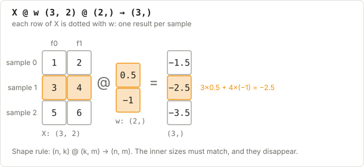

# F2: Linear algebra for ML

**New words?** [vector](../00_basics/B1_glossary.md#vector) · [matrix](../00_basics/B1_glossary.md#matrix) · [dot product](../00_basics/B1_glossary.md#dot-product) · [distance](../00_basics/B1_glossary.md#distance) · [transpose](../00_basics/B1_glossary.md#transpose) · [weight](../00_basics/B1_glossary.md#weight) · [feature](../00_basics/B1_glossary.md#feature) · or the full [glossary](../00_basics/B1_glossary.md).

**Learning objectives.** After this lecture you can:

- compute a dot product and a matrix product, and predict their shapes
- explain why `X @ w` makes a prediction for every sample at once
- compute Euclidean distance
- say what an eigenvector of a covariance matrix means (for PCA)

---

## 1. Vectors and the dot product

A **vector** is a list of numbers, for example one sample's features: $x = (x_1, x_2, \dots, x_f)$.

The **dot product** of two vectors of the same length multiplies them element by element and adds up the results:

$$x \cdot w = \sum_{j=1}^{f} x_j w_j$$

```python
x = np.array([2.0, 3.0])
w = np.array([0.5, -1.0])
x @ w          # 2*0.5 + 3*(-1) = -2.0
```


*Matching colours are multiplied together, then everything is added up.*

**Two ways to read it:**

- **A weighted sum.** Each feature gets a weight saying how much it matters. This is the heart
  of linear and logistic regression and every neural network layer.
- **A similarity.** The dot product is large when two vectors point the same way, zero when they
  are perpendicular, and negative when they point opposite ways. This is the heart of attention.

## 2. Matrix multiplication

A matrix product `A @ B` is "a dot product of every row of A with every column of B".

**Shape rule:** `(n, k) @ (k, m) -> (n, m)`. The inner sizes must match, and they disappear.

```python
X = np.array([[1., 2.],
              [3., 4.],
              [5., 6.]])    # (3, 2): 3 samples
w = np.array([0.5, -1.0])   # (2,)
X @ w                       # (3,): one weighted sum per sample -> [-1.5, -2.5, -3.5]
```



*The orange row of X is dotted with w to give the orange output. Every other row works the same way.*

That's why the linear model `X @ w + b` predicts every sample at once: row *i* of the result is
the dot product of sample *i* with the weights.

A neural network layer has **many** weight vectors (one per output unit), stacked as the
columns of `W`:

```python
W = np.random.randn(2, 4)   # 2 inputs -> 4 hidden units
H = X @ W                   # (3, 2) @ (2, 4) -> (3, 4): each sample now has 4 features
```


*Each coloured column of X becomes a row of X.T.*

**The transpose** `A.T` swaps the rows and columns: `(n, k) -> (k, n)`. You'll see it in gradients
like `X.T @ error`, which is "for each feature, sum feature × error over all samples".

> **Shape trick for gradients:** if you need `(f,)` and you have `X (n,f)` and `error (n,)`, the
> only product that works is `X.T @ error`: `(f,n) @ (n,) -> (f,)`. Shapes tell you where the
> transposes go.

## 3. Length and distance

The **norm** (length) of a vector: $\lVert x \rVert = \sqrt{\sum_j x_j^2}$ (`np.linalg.norm(x)`).

The **Euclidean distance** between two points is the length of their difference:

$$d(a, b) = \sqrt{\sum_j (a_j - b_j)^2}$$

Example: $a=(1,1)$, $b=(4,5)$ gives $\sqrt{3^2 + 4^2} = 5$.

When you only need to **compare** distances (which is closest?), skip the square root: it
doesn't change the order. K-Means does exactly this.

**Feature scale matters.** If one feature is in metres (0–2) and another in grams (0–5000), the
grams dominate every distance. That's why we **standardise** features: subtract the mean and divide
by the standard deviation.

## 4. Eigenvectors (only needed for PCA, Week 4)

For a square matrix $C$, an **eigenvector** $v$ is a direction that $C$ only stretches, without
rotating it:

$$C v = \lambda v$$

$\lambda$ (the **eigenvalue**) is the stretch factor.

Why we care: when $C$ is the **covariance matrix** of the data, its eigenvectors are the
directions in which the data spreads out, and each eigenvalue is **how much variance** lies along
that direction. The eigenvector with the largest eigenvalue is the "main axis" of the data cloud.
That is PCA in one sentence.

Covariance matrices are symmetric, so we use `np.linalg.eigh`. It returns eigenvalues in
**ascending** order, with the eigenvectors as **columns**.

```python
C = np.array([[2.0, 0.0],
              [0.0, 0.5]])
vals, vecs = np.linalg.eigh(C)   # vals = [0.5, 2.0], vecs = identity columns
# The data spreads most along the x-axis (variance 2.0).
```

## Check yourself

1. What is the shape of `(50, 3) @ (3, 8)`? Is `(50, 3) @ (50, 8)` valid?
2. `X` is `(n, f)` and `error` is `(n,)`. Which expression has shape `(f,)`: `X @ error` or `X.T @ error`?
3. Compute the dot product of `(1, 2, 3)` and `(4, 0, -1)`.
4. Two unit vectors have dot product 0. What does that say about them?
5. Why can K-Means compare squared distances instead of distances?

<details>
<summary>Answers</summary>

1. `(50, 8)`. No: the inner sizes 3 and 50 don't match.
2. `X.T @ error`: `(f, n) @ (n,) -> (f,)`. (`X @ error` doesn't even run unless n = f.)
3. 4 + 0 − 3 = 1.
4. They are perpendicular, i.e. "unrelated" as a similarity.
5. The square root always increases with its input, so the smallest squared distance is also the smallest distance.

</details>

**Next:** [F3: Calculus and gradient descent](F3_calculus_and_gradient_descent.md)
