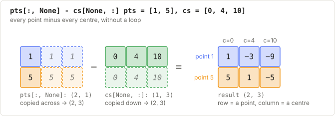
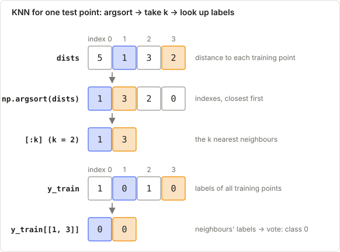

# Week 1: K-Nearest Neighbours (KNN)

**Prerequisites:** [F1 NumPy](../00_foundations/F1_numpy.md) (broadcasting, argsort, bincount), [F2 distance](../00_foundations/F2_linear_algebra.md).

**New words?** [sample](../00_basics/B1_glossary.md#sample) · [feature](../00_basics/B1_glossary.md#feature) · [label](../00_basics/B1_glossary.md#label) · [class 0 and class 1](../00_basics/B1_glossary.md#class-0-and-class-1) · [distance](../00_basics/B1_glossary.md#distance) · [index](../00_basics/B1_glossary.md#index) · [hyperparameter](../00_basics/B1_glossary.md#hyperparameter) · [overfitting](../00_basics/B1_glossary.md#overfitting) · or the full [glossary](../00_basics/B1_glossary.md).

**Learning objectives.** After this lecture you can:

- explain KNN in one sentence and say why it is called a "lazy learner"
- classify a point by hand using Euclidean distance and a majority vote
- explain how k controls overfitting vs underfitting
- write the vectorised implementation from memory

---

## 1. The problem

**Classification:** given labelled examples, predict the class of a new point.

## 2. Intuition

> "Tell me who your neighbours are and I'll tell you who you are."

To classify a new point, look at the **k** training points closest to it and take a **majority
vote** of their labels. That's the whole algorithm.

- **Training does nothing** except store the data, which is why it's called a *lazy learner*.
- **All the work happens at prediction time:** distances to every training point.

## 3. The algorithm

For each query point $q$:

1. Compute the distance from $q$ to every training point: $d_i = \sqrt{\sum_j (q_j - x_{ij})^2}$
2. Find the indices of the $k$ smallest distances.
3. Return the most common label among those $k$ neighbours.

## 4. Worked example (do it on paper first)

Training data:

| Point | Coordinates | Class |
|-------|-------------|-------|
| A | (1, 1) | 0 (red) |
| B | (2, 1) | 0 (red) |
| C | (2, 4) | 1 (blue) |
| D | (4, 4) | 1 (blue) |
| E | (5, 4) | 1 (blue) |

Query $q = (2, 2)$.

**Step 1: distances**

| Point | Calculation | Distance |
|-------|-------------|----------|
| A | $\sqrt{(2-1)^2 + (2-1)^2} = \sqrt{2}$ | 1.414 |
| B | $\sqrt{0^2 + 1^2}$ | 1.000 |
| C | $\sqrt{0^2 + 2^2}$ | 2.000 |
| D | $\sqrt{2^2 + 2^2} = \sqrt{8}$ | 2.828 |
| E | $\sqrt{3^2 + 2^2} = \sqrt{13}$ | 3.606 |

**Step 2: sorted order:** B, A, C, D, E.

**Step 3: vote**

- **k = 1:** {B} gives **red**
- **k = 3:** {B, A, C} gives red, red, blue, so **red**
- **k = 5:** all of them: 2 red vs 3 blue gives **blue**

The same point gets a different answer as k grows. **k is the key hyperparameter.**

## 5. From maths to code

| Maths | Code ([solution.py](solution.py)) |
|-------|------------------------|
| store the training set | `self.X_train = X; self.y_train = y` |
| $d_{qi}$ for every query $q$ and every training point $i$ | `np.sqrt(((X[:, None, :] - self.X_train[None, :, :]) ** 2).sum(axis=2))` gives `(n_test, n_train)` |
| indices of the k smallest | `np.argsort(dists, axis=1)[:, :self.k]` gives `(n_test, k)` |
| labels of those neighbours | `self.y_train[nearest]` gives `(n_test, k)` |
| majority vote | `np.bincount(row).argmax()` for each row |

The broadcasting line is the hard one. Re-read [F1 §4](../00_foundations/F1_numpy.md) until it's obvious.

*The same idea in 1-D: a column of points minus a row of training points gives every difference at once. With features, there is one more axis.*

*One test point's journey through predict(): blue and orange follow its two nearest neighbours.*

## 6. Choosing k, and pitfalls

- **Small k (e.g. 1)** gives a jagged boundary that follows the noise: **overfitting** (high variance).
- **Large k** gives a smooth boundary. At the extreme (k = n) it always predicts the majority class: **underfitting**.
- Use an **odd k** for 2 classes to avoid tied votes. Choose k with a validation set.
- **Scale your features**, or the feature with the biggest range dominates the distance.
- **Cost:** prediction is $O(n_{\text{train}} \cdot f)$ per query, which is slow for big datasets
  (real libraries use KD-trees / ball trees / approximate search).
- **Curse of dimensionality:** in very high dimensions all the points are about equally far apart, so "nearest" means little.
- `np.bincount` needs **non-negative integer labels**.
- For **regression**, return the **mean** of the neighbours' values instead of a vote.

## 7. Tutorial questions

1. Using the worked example, classify $q = (4, 3)$ with k = 1 and with k = 3.
2. If feature 1 is in metres and feature 2 in millimetres, what goes wrong and how do you fix it?
3. What is the training accuracy of 1-NN (assuming no duplicate points)? Why is that not good news?
4. What are the shapes of `dists`, `nearest` and `nearest_labels` for 200 test points, 1000 training points, 5 features and k = 7?

Answers

1. Distances: A 3.606, B 2.828, C 2.236, D 1.0, E 1.414. k=1: {D} gives blue. k=3: {D, E, C} gives blue.
2. The millimetre feature has 1000× larger differences and dominates the distance. Standardise each feature.
3. 100%: every training point is its own nearest neighbour. It's memorisation, and it says nothing about the test performance.
4. `(200, 1000)`, `(200, 7)`, `(200, 7)`.

## 8. Interview questions

What is the time complexity of training and prediction?

Training is O(1) (just storing the data). Prediction is O(n·f) per query for the distances, plus O(n log n) for a full sort
(O(n) with `argpartition`).

How would you speed it up?

`np.argpartition` instead of a full sort; KD-trees or ball trees for low dimensions; approximate nearest
neighbours (e.g. FAISS, HNSW) for large or high-dimensional data; reduce the dimensions with PCA.

Weighted KNN?

Weight each neighbour's vote by 1/distance, so closer neighbours count more. This also breaks ties.

## 9. Lab

1. Read [explained.py](explained.py) and run `python example.py`.
2. Fill in your practice file (in the course app, or `my_practice.py`).
3. Then do the blank-file rewrite, then timed attempts. Target: **10 minutes**.
