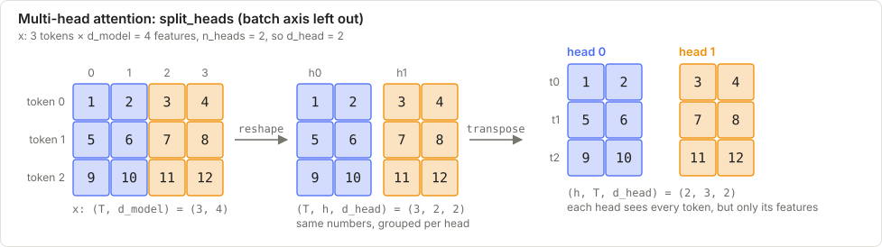

# Weeks 4–5: Attention and Multi-Head Attention

**Prerequisites:** [F2 the dot product as a similarity](../00_foundations/F2_linear_algebra.md), [F4 softmax](../00_foundations/F4_probability.md), [F1 reshape and transpose](../00_foundations/F1_numpy.md).

**New words?** [vector](../00_basics/B1_glossary.md#vector) · [matrix](../00_basics/B1_glossary.md#matrix) · [dot product](../00_basics/B1_glossary.md#dot-product) · [shape](../00_basics/B1_glossary.md#shape) · [transpose](../00_basics/B1_glossary.md#transpose) · [axis](../00_basics/B1_glossary.md#axis) · or the full [glossary](../00_basics/B1_glossary.md).

**Learning objectives.** After this lecture you can:

- explain queries, keys and values with the "soft dictionary lookup" analogy
- compute scaled dot-product attention by hand
- explain why we scale by $\sqrt{d_k}$ and how the causal mask works
- implement multi-head attention with the split/merge reshapes

---

## 1. The problem

A sequence of tokens (words) is a matrix `x` of shape `(T, d_model)`: one vector per position. Each
token's meaning depends on the **other** tokens ("bank" next to "river" vs "money"). Attention lets
every position **gather information from every other position**, weighted by relevance.

## 2. Intuition: a soft dictionary lookup

A Python dict does a *hard* lookup: the query must exactly match one key, and you get that one value.
Attention does a *soft* lookup:

- each position emits a **query** (what am I looking for?), a **key** (what do I contain?) and a **value** (what will I hand over?)
- the **query · key** dot product measures the match
- **softmax** turns the matches into weights that sum to 1
- the output is the **weighted average of the values**

$$\text{Attention}(Q, K, V) = \text{softmax}\!\left(\frac{QK^\top}{\sqrt{d_k}}\right)V$$

Shapes: $Q$ is `(T_q, d_k)`, $K$ is `(T_k, d_k)`, $V$ is `(T_k, d_v)`. Then $QK^\top$ is `(T_q, T_k)`, and the output is `(T_q, d_v)`.

$Q, K, V$ come from **learned projections** of the input: $Q = xW_Q$, $K = xW_K$, $V = xW_V$.
In **self-attention** all three come from the same `x`.

## 3. Why divide by $\sqrt{d_k}$?

If the query and key entries have variance 1, their dot product (a sum of $d_k$ terms) has variance $d_k$.
Big scores push the softmax into a near one-hot saturation, where the gradients vanish. Dividing by $\sqrt{d_k}$
brings the variance back to about 1.

## 4. Masking

- **Causal mask** (GPT-style decoders): position $i$ may only attend to positions $\le i$. Otherwise it could
  "see the future" it is supposed to predict. The mask is the lower-triangular matrix `np.tril(ones)`.
- **Padding mask:** ignore padded tokens.

Implementation: set the blocked scores to a huge negative number **before** the softmax, so their weight is $e^{-\infty} \approx 0$.

## 5. Worked example (by hand)

Two tokens, $d_k = 2$.

$$Q = \begin{pmatrix}1&0\\0&1\end{pmatrix},\ K = \begin{pmatrix}1&0\\1&1\end{pmatrix},\ V = \begin{pmatrix}10&0\\0&10\end{pmatrix}$$

| Step | Calculation | Result |
|------|-------------|--------|
| $QK^\top$ | row 1: $(1\cdot1+0,\ 1\cdot1+0) = (1, 1)$; row 2: $(0,\ 1)$ | $\begin{pmatrix}1&1\\0&1\end{pmatrix}$ |
| $\div\sqrt2$ | | $\begin{pmatrix}0.707&0.707\\0&0.707\end{pmatrix}$ |
| softmax per row | row 1: equal, so (0.5, 0.5); row 2: $e^0 : e^{0.707}$ | $\begin{pmatrix}0.5&0.5\\0.330&0.670\end{pmatrix}$ |
| $\times V$ | row 1: $0.5(10,0)+0.5(0,10)$ | $\begin{pmatrix}5&5\\3.30&6.70\end{pmatrix}$ |

**With a causal mask**, token 1 may not see token 2: its scores become $(0.707, -\infty)$, the weights $(1, 0)$, and the output $(10, 0)$.
Token 2 is unchanged (it may see both).

## 6. Multi-head attention

One attention can only focus one way at a time. **Multi-head** runs $h$ attentions in parallel, each on a
$d_{\text{head}} = d_{\text{model}}/h$ slice, so different heads can track different relations (syntax, coreference, position).

```
x (B,T,d_model) --W_q--> (B,T,d_model) --split--> (B,h,T,d_head)
attention per (batch, head)                     -> (B,h,T,d_head)
merge (concatenate the heads)                   -> (B,T,d_model) --W_o--> output
```

**split_heads:** `reshape(B, T, h, d_head)` then `transpose(0, 2, 1, 3)`, which moves the head axis before time so
`Q @ K.swapaxes(-2, -1)` computes `(B, h, T, T)` in one go. **merge_heads** is the exact reverse.

The total compute is about the same as a single head of full width.



*Blue features go to head 0 and orange to head 1. Every head still sees every token.*

## 7. From maths to code

| Maths | Code |
|-------|------|
| $QK^\top/\sqrt{d_k}$ | `Q @ K.swapaxes(-2, -1) / np.sqrt(d_k)` (swap only the last two axes; `.T` would reverse the batch axes too) |
| mask | `np.where(mask, scores, -1e9)` with `mask = np.tril(np.ones((T, T), dtype=bool))` |
| softmax over the keys | `softmax(scores, axis=-1)` |
| output | `weights @ V` |
| heads | `split_heads` / `merge_heads` reshapes, then `@ self.W_o` |

## 8. Pitfalls

- Softmax over the **wrong axis** (it must be the keys, the last axis).
- Using `K.T` on 4-D arrays (it reverses **all** the axes).
- Applying the mask **after** the softmax (the rows no longer sum to 1, and information leaks in the gradients).
- Mixing up `reshape` and `transpose`: you must reshape `(B,T,d)` into `(B,T,h,d_head)` **first**, then transpose. Reshaping directly to `(B,h,T,d_head)` scrambles the data.
- Attention is **permutation-invariant**: it has no notion of order. Transformers add **positional encodings** to `x`.
- Cost is $O(T^2)$ in the sequence length, the main bottleneck for long contexts.

## 9. Tutorial questions

1. In the worked example, what would token 1's output be if its query were $(0, 10)$?
2. Why does the causal mask use `tril` and not `triu`?
3. With B=2, T=5, d_model=16, h=4, what are the shapes of Q after the split, of the scores, and of the output?
4. Why does changing the **last** token not change earlier outputs under a causal mask? (The lab checks this.)

<details>
<summary>Answers</summary>

1. Scores: $(0, 10)/\sqrt2 = (0, 7.07)$, so the weights are about $(0.001, 0.999)$ and the output about $(0, 10)$: it "looked up" token 2.
2. Row i (the query) may use the columns j ≤ i (the keys): that's the lower triangle, including the diagonal.
3. Q `(2, 4, 5, 4)`, scores `(2, 4, 5, 5)`, output `(2, 5, 16)`.
4. Earlier rows give the last column zero weight, so its key and value never enter their weighted sums.

</details>

## 10. Interview questions

<details>
<summary>What is the difference between self-attention and cross-attention?</summary>

Self-attention takes Q, K and V from the same sequence. Cross-attention (in an encoder-decoder) takes Q from the decoder and K, V from the encoder output.
</details>

<details>
<summary>Why multiple heads instead of one big one?</summary>

Each head can learn a different attention pattern in its own subspace, for the same total compute. One head averages everything into one pattern.
</details>

<details>
<summary>What is the complexity, and how do people reduce it?</summary>

O(T²·d) time and O(T²) memory. Reductions: FlashAttention (IO-aware, exact), sparse or sliding-window attention, linear attention approximations, KV caching for generation.
</details>

## 11. Lab

Read [explained.py](explained.py) and run `python example.py`: the soft lookup, the causal check, and multi-head = concatenated heads. Target: **15 minutes**.
